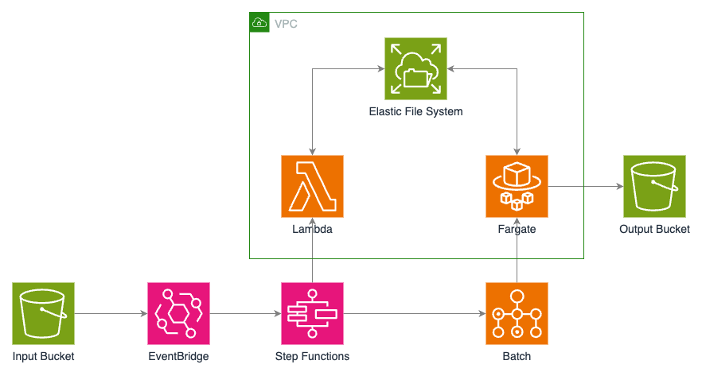

# Blender Rendering in AWS

This project uses the Amazon Web Services (AWS) [Cloud Development Kit (CDK)](https://aws.amazon.com/cdk/) to deploy a serverless pipeline that renders Blender animation projects in the cloud.

This project was inspired by and partly based on this AWS [workshop](https://ec2spotworkshops.com/rendering-with-batch.html), including the code [here](https://github.com/awslabs/ec2-spot-workshops/tree/master/content/rendering-with-batch). Building on that project, I've made a number of enhancements.

## Architecture

The basic flow of the pipeline is as follows:

1. A `.blend` or `.zip` file for a Blender project is uploaded to the input bucket in [Simple Storage Service (S3)](https://aws.amazon.com/s3/).
1. An [EventBridge](https://aws.amazon.com/eventbridge/) rule triggers a state machine in [Step Functions](https://aws.amazon.com/step-functions/), which executes the following steps:
   1. A [Lambda](https://aws.amazon.com/lambda/) function extracts the `.zip` file (if required) and writes the project file(s) to [Elastic File System (EFS)](https://aws.amazon.com/efs/).
   1. A Lambda function analyzes the `.blend` file and determines how many frames need to be rendered.
   1. A [Batch](https://aws.amazon.com/batch/) job is created and executes container-based tasks in [Fargate](https://aws.amazon.com/fargate/), each of which renders a single frame and writes it to EFS.
   1. A single-task Batch job is created to stich the frames together into a movie file, which is uploaded to the output bucket in S3.
